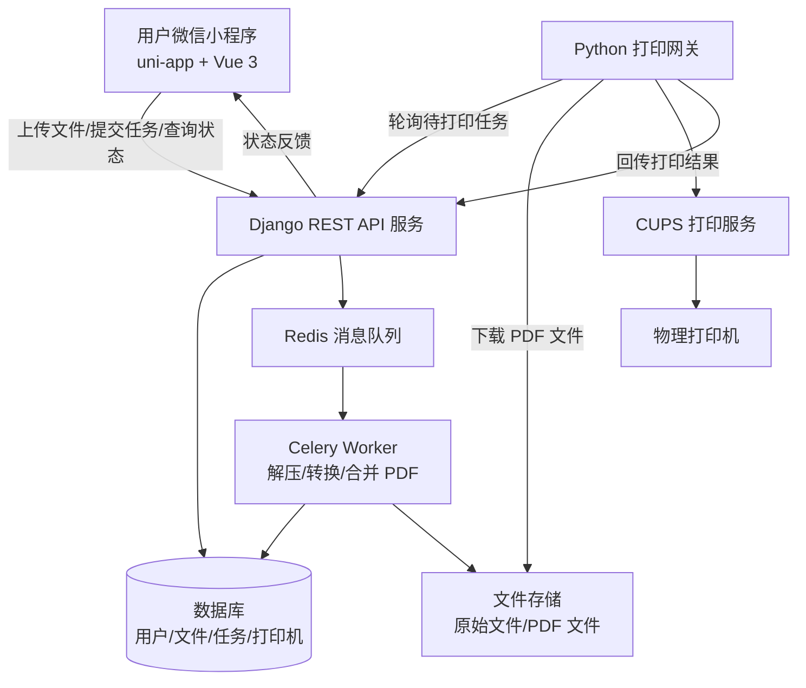
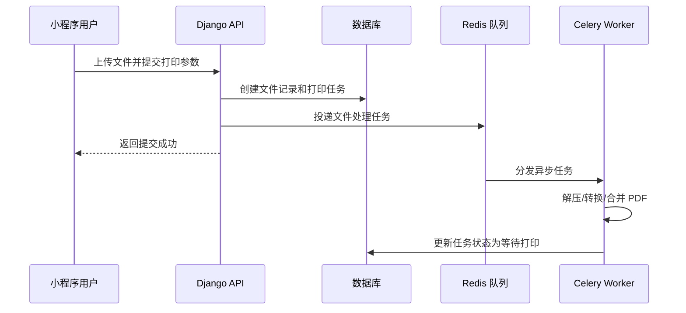
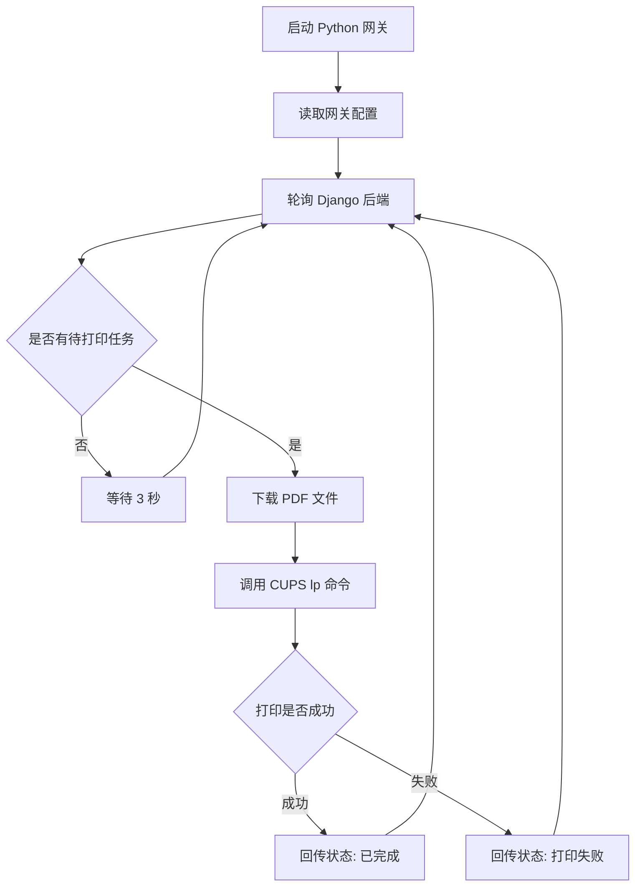
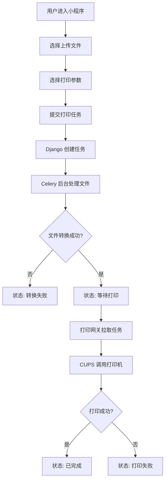
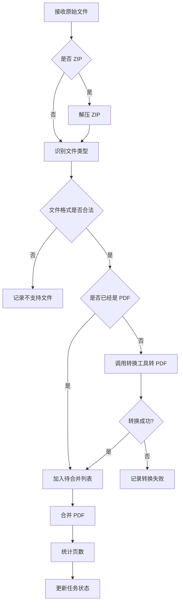
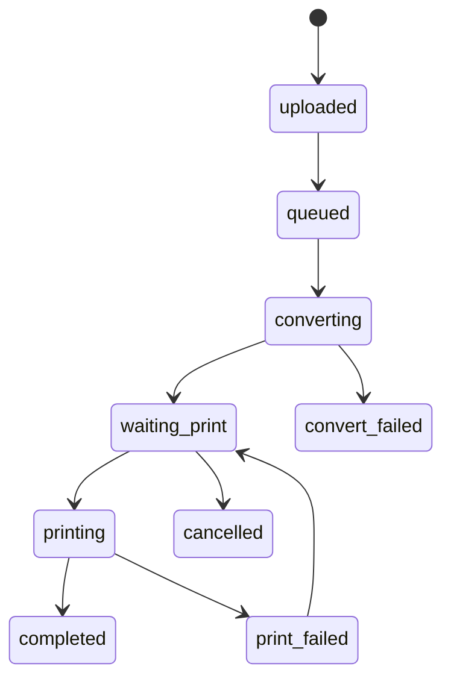

# 基于 uni-app 与 Django 的校园自助打印系统技术实施方案

> 适用场景：校园自助打印、宿舍楼打印点、实验室打印终端、社团/学院共享打印服务。  
> 当前目标：在 20 天左右完成一个可以演示、可以部署、可以联调的 MVP 版本。  
> 技术路线：微信小程序端 + Django 云端服务 + Python 边缘打印网关 + CUPS 打印控制。

---

## 1. 项目背景

在校园场景中，学生打印作业、实验报告、论文材料等文件时，经常会遇到以下问题：

1. 需要人工通过微信、QQ、U 盘等方式传文件；
2. 打印参数需要人工确认，例如份数、单双面、黑白/彩色；
3. 打印任务没有状态反馈，用户不知道是否已经打印完成；
4. 打印店或打印点需要手动整理文件，效率较低；
5. 文件格式复杂，可能包含 PDF、Word、PPT、Excel、图片、ZIP 压缩包等。

因此，本项目设计一个基于微信小程序的自助打印系统。用户可以在微信小程序中上传文件、选择打印参数、提交打印任务并查看任务状态；后端系统负责文件管理、任务排队、格式转换和状态管理；打印机旁边部署一个边缘网关，负责拉取待打印任务并调用本地打印机完成打印。

---

## 2. 最终推荐技术栈

考虑到系统需要进入微信小程序，同时又需要较强的后端文件处理能力，本项目推荐采用以下技术栈：

| 层级 | 技术选型 | 作用 |
|---|---|---|
| 小程序端 | uni-app + Vue 3 | 开发微信小程序页面 |
| 小程序 UI | uni-ui / uView Plus | 快速构建表单、列表、按钮、上传页面 |
| 后端框架 | Django | 业务逻辑、数据库模型、后台管理 |
| API 框架 | Django REST Framework | 提供小程序调用的 RESTful API |
| 后台管理 | Django Admin | 管理员查看用户、文件、任务、打印机状态 |
| 异步任务 | Celery | 执行 ZIP 解压、文件转换、PDF 合并等耗时任务 |
| 消息队列 | Redis | Celery 的任务队列 Broker |
| 数据库 | SQLite / PostgreSQL / MySQL | 存储用户、文件、打印任务、打印机信息 |
| 文件转换 | LibreOffice | Word、PPT、Excel 转 PDF |
| 图片处理 | Pillow / ImageMagick | 图片格式转换、图片转 PDF |
| PDF 处理 | pypdf / PyMuPDF | PDF 合并、页数统计、文件检查 |
| 打印网关 | Python | 部署在打印机旁，负责拉取任务并打印 |
| 打印系统 | CUPS | Linux 下调用真实打印机 |
| 部署方式 | Linux + systemd / Docker Compose | 后端服务、任务队列、网关进程部署 |

---

## 3. 为什么选择这套方案

### 3.1 为什么不直接使用 Vue 3 + Django 网页方案？

如果系统只做 PC 网页，Vue 3 + Django 是可行的。但本项目的最终入口是微信小程序，因此 PC 网页不是第一优先级。

如果先做 Vue 3 网页，再做微信小程序，会造成两套前端重复开发：

```text
PC 端 Vue 3 页面
微信小程序页面
Django 后端 API
```

这会增加 20 天内交付的风险。

### 3.2 为什么不使用 Django Templates 一体化方案？

Django Templates 适合传统 Web 页面，不适合直接运行在微信小程序中。

微信小程序有自己的页面结构和运行环境，通常使用 WXML/WXSS/JS，或者通过 uni-app、Taro 等跨端框架生成小程序代码。

所以，本项目后端应该转为 API 服务：

```text
Django 负责 API、数据库、后台、文件处理
微信小程序负责页面展示和用户交互
```

### 3.3 为什么推荐 uni-app + Vue 3？

uni-app 可以使用 Vue 语法开发小程序页面，适合希望保留 Vue 技术路线的项目。

使用 uni-app 后，可以做到：

1. 使用 Vue 3 的开发思路；
2. 编译为微信小程序；
3. 页面开发效率高；
4. 后续可以扩展到 H5、App 等端；
5. 比直接写原生 WXML/WXSS 更适合快速开发。

### 3.4 为什么后端使用 Django？

Django 适合本项目的原因：

1. ORM 强大，数据库表开发效率高；
2. Django Admin 可以直接作为管理员后台；
3. DRF 能快速开发 API；
4. Python 生态适合文件处理、PDF 处理和系统命令调用；
5. Celery 与 Django 集成成熟，适合后台任务处理；
6. Python 网关可以和后端保持同一语言生态。

---

## 4. 总体架构设计

本系统采用：

```text
微信小程序端 + 云端 Django 服务 + 边缘打印网关 + 物理打印机
```

整体架构如下：



---

## 5. 系统分层说明

### 5.1 小程序端

小程序端主要负责用户操作，不直接处理复杂业务。

核心功能：

1. 用户登录；
2. 文件选择与上传；
3. 打印参数配置；
4. 订单确认；
5. 任务状态查询；
6. 历史打印记录查看。

页面建议：

```text
pages/
├── index/                 # 首页
├── upload/                # 文件上传页
├── print-options/         # 打印参数选择页
├── order-confirm/         # 订单确认页
├── task-status/           # 打印状态页
├── history/               # 历史记录页
└── profile/               # 我的页面
```

小程序端不负责：

1. Office 文件转 PDF；
2. ZIP 文件解压；
3. 调用打印机；
4. 复杂队列管理；
5. 打印机异常检测。

这些全部交给 Django 后端和打印网关。

---

### 5.2 Django 后端服务

Django 后端是整个系统的核心。

主要负责：

1. 用户身份管理；
2. 文件上传接口；
3. 文件记录管理；
4. 打印任务创建；
5. 打印任务状态管理；
6. Celery 异步任务调度；
7. 打印网关任务接口；
8. 管理员后台；
9. 异常记录和日志管理。

建议 Django App 拆分：

```text
backend/
├── config/                # Django 项目配置
├── apps/
│   ├── users/             # 用户模块
│   ├── files/             # 文件上传与文件管理
│   ├── print_tasks/       # 打印任务模块
│   ├── printers/          # 打印机与网关模块
│   └── common/            # 通用工具、枚举、权限、响应格式
├── media/                 # 用户上传文件与转换文件
├── requirements.txt
└── manage.py
```

---

### 5.3 Celery 异步任务

文件转换任务通常耗时较长，不能放在普通 HTTP 请求中同步执行。

例如：

1. 解压 ZIP；
2. Word 转 PDF；
3. PPT 转 PDF；
4. Excel 转 PDF；
5. 图片转 PDF；
6. 多文件合并 PDF；
7. 统计 PDF 页数；
8. 更新任务状态。

这些操作都应该交给 Celery Worker 后台执行。

任务流程：



---

### 5.4 边缘打印网关

微信小程序和 Django 云端服务通常无法直接控制打印机，尤其是在打印机位于局域网内部时。

因此，需要在打印机附近部署一个 Python 网关程序。

网关职责：

1. 定时请求 Django 后端；
2. 获取待打印任务；
3. 下载转换后的 PDF 文件；
4. 根据打印参数调用 CUPS；
5. 监控打印命令执行结果；
6. 回传任务状态。

网关基本流程：



---

## 6. 核心业务流程

### 6.1 用户打印流程



### 6.2 文件转换流程



---

## 7. 数据库设计建议

### 7.1 用户表 User

如果项目初期不做复杂用户系统，可以先使用 Django 自带 User 模型。

后续可扩展字段：

| 字段 | 类型 | 说明 |
|---|---|---|
| id | int | 用户 ID |
| username | varchar | 用户名 |
| openid | varchar | 微信小程序用户唯一标识 |
| phone | varchar | 手机号，可选 |
| nickname | varchar | 昵称 |
| created_at | datetime | 创建时间 |

---

### 7.2 文件表 UploadedFile

| 字段 | 类型 | 说明 |
|---|---|---|
| id | int | 文件 ID |
| user | foreign key | 所属用户 |
| original_name | varchar | 原始文件名 |
| file_path | varchar | 原始文件路径 |
| file_type | varchar | 文件类型 |
| file_size | int | 文件大小 |
| converted_pdf_path | varchar | 转换后的 PDF 路径 |
| status | varchar | 文件处理状态 |
| error_message | text | 错误信息 |
| created_at | datetime | 上传时间 |

文件状态建议：

```text
uploaded        已上传
processing      处理中
converted       已转换
failed          转换失败
unsupported     不支持格式
```

---

### 7.3 打印任务表 PrintTask

| 字段 | 类型 | 说明 |
|---|---|---|
| id | int | 任务 ID |
| user | foreign key | 提交用户 |
| task_no | varchar | 任务编号 |
| final_pdf_path | varchar | 最终待打印 PDF |
| copies | int | 份数 |
| color_mode | varchar | 黑白/彩色 |
| duplex | varchar | 单双面 |
| page_count | int | 页数 |
| total_price | decimal | 总价，可选 |
| status | varchar | 任务状态 |
| printer | foreign key | 指定打印机 |
| error_message | text | 错误信息 |
| created_at | datetime | 创建时间 |
| updated_at | datetime | 更新时间 |

任务状态建议：

```text
pending_upload      等待上传
uploaded            已上传
queued              已入队
converting          转换中
waiting_print       等待打印
printing            打印中
completed           已完成
convert_failed      转换失败
print_failed        打印失败
cancelled           已取消
```

任务状态流转：



---

### 7.4 打印机表 Printer

| 字段 | 类型 | 说明 |
|---|---|---|
| id | int | 打印机 ID |
| name | varchar | 打印机名称 |
| location | varchar | 打印机位置 |
| cups_name | varchar | CUPS 中的打印机名称 |
| status | varchar | 在线/离线/异常 |
| support_color | bool | 是否支持彩色 |
| support_duplex | bool | 是否支持双面 |
| created_at | datetime | 创建时间 |
| updated_at | datetime | 更新时间 |

---

### 7.5 网关表 PrintGateway

| 字段 | 类型 | 说明 |
|---|---|---|
| id | int | 网关 ID |
| name | varchar | 网关名称 |
| token | varchar | 网关认证 Token |
| location | varchar | 部署位置 |
| last_heartbeat | datetime | 最后心跳时间 |
| status | varchar | 在线/离线 |
| created_at | datetime | 创建时间 |

---

## 8. API 接口规划

### 8.1 小程序端 API

| 接口 | 方法 | 说明 |
|---|---|---|
| `/api/auth/wechat-login/` | POST | 微信登录 |
| `/api/files/upload/` | POST | 上传文件 |
| `/api/print-tasks/` | POST | 创建打印任务 |
| `/api/print-tasks/` | GET | 获取我的打印任务 |
| `/api/print-tasks/{id}/` | GET | 获取任务详情 |
| `/api/print-tasks/{id}/cancel/` | POST | 取消任务 |
| `/api/print-options/` | GET | 获取可选打印参数 |
| `/api/user/profile/` | GET | 获取用户信息 |

### 8.2 打印网关 API

| 接口 | 方法 | 说明 |
|---|---|---|
| `/api/gateway/heartbeat/` | POST | 网关心跳 |
| `/api/gateway/tasks/next/` | GET | 获取下一个待打印任务 |
| `/api/gateway/tasks/{id}/start/` | POST | 标记任务开始打印 |
| `/api/gateway/tasks/{id}/finish/` | POST | 标记任务打印完成 |
| `/api/gateway/tasks/{id}/fail/` | POST | 标记任务打印失败 |
| `/api/gateway/tasks/{id}/download/` | GET | 下载待打印 PDF |

### 8.3 管理端功能

管理端可以优先使用 Django Admin，不必单独开发前端后台。

管理员可以管理：

1. 用户；
2. 上传文件；
3. 打印任务；
4. 打印机；
5. 网关；
6. 异常日志；
7. 系统配置。

---

## 9. 项目目录建议

### 9.1 总体目录

```text
self-printing-system/
├── README.md
├── docs/
│   ├── technical-plan.md
│   ├── api-design.md
│   ├── database-design.md
│   └── deployment.md
├── miniapp/
│   ├── pages/
│   ├── components/
│   ├── utils/
│   ├── static/
│   ├── App.vue
│   ├── main.js
│   ├── pages.json
│   └── manifest.json
├── backend/
│   ├── config/
│   ├── apps/
│   │   ├── users/
│   │   ├── files/
│   │   ├── print_tasks/
│   │   ├── printers/
│   │   └── common/
│   ├── media/
│   ├── requirements.txt
│   └── manage.py
├── gateway/
│   ├── gateway.py
│   ├── config.example.yaml
│   └── requirements.txt
├── scripts/
│   ├── install_libreoffice.sh
│   ├── install_cups.sh
│   └── init_project.sh
└── docker-compose.yml
```

---

## 10. 20 天开发排期

按照北京时间，4 月 25 日到 5 月 15 日约 20 天，建议按 MVP 目标推进。

### 第 1 阶段：项目骨架与基础环境，4.25 - 4.28

目标：把前后端项目跑起来。

任务：

1. 创建 GitHub 仓库；
2. 初始化 uni-app 小程序项目；
3. 初始化 Django 后端项目；
4. 配置 Django REST Framework；
5. 设计数据库模型；
6. 配置 Django Admin；
7. 完成基础接口结构；
8. 完成小程序基础页面。

交付物：

```text
小程序可以运行
Django 后端可以启动
数据库迁移成功
Django Admin 可以登录
```

---

### 第 2 阶段：文件上传与任务创建，4.29 - 5.3

目标：实现用户提交打印任务。

任务：

1. 小程序端完成文件选择；
2. 实现文件上传 API；
3. 后端保存文件记录；
4. 创建打印任务；
5. 保存打印参数；
6. 实现任务列表和任务详情接口；
7. 小程序端展示任务状态。

交付物：

```text
用户可以上传文件
用户可以选择打印参数
后端可以生成打印任务
小程序可以查看任务状态
```

---

### 第 3 阶段：文件处理与 PDF 转换，5.4 - 5.8

目标：完成核心文件处理流程。

任务：

1. 配置 Redis；
2. 配置 Celery；
3. 实现 ZIP 解压；
4. 实现 PDF 文件识别；
5. 实现 Word/PPT/Excel 转 PDF；
6. 实现图片转 PDF；
7. 实现多 PDF 合并；
8. 实现页数统计；
9. 更新任务状态。

交付物：

```text
上传文件后可以自动转成 PDF
转换成功后任务状态变为等待打印
转换失败可以记录错误信息
```

---

### 第 4 阶段：打印网关与 CUPS 联调，5.9 - 5.12

目标：让系统真正可以调用打印机。

任务：

1. 安装并配置 CUPS；
2. 确认命令行可以打印 PDF；
3. 编写 Python 网关；
4. 网关轮询 Django 后端；
5. 网关下载待打印 PDF；
6. 网关调用 `lp` 命令打印；
7. 网关回传打印状态。

交付物：

```text
后端有待打印任务时
网关可以自动拉取并打印
打印完成后任务状态更新为已完成
```

---

### 第 5 阶段：联调、测试与文档整理，5.13 - 5.15

目标：完成演示版本和项目材料。

任务：

1. 小程序端完整流程测试；
2. 后端接口测试；
3. 文件转换异常测试；
4. 打印异常测试；
5. 管理后台测试；
6. 整理 GitHub README；
7. 整理系统截图；
8. 准备答辩/汇报材料。

交付物：

```text
系统可完整演示
GitHub 文档完整
核心流程截图完整
可说明项目架构、功能和技术选型
```

---

## 11. MVP 功能范围

20 天内建议先完成 MVP，不要一开始做过多扩展功能。

### 11.1 必须完成

1. 微信小程序上传文件；
2. 选择打印参数；
3. 创建打印任务；
4. 后端保存文件和任务；
5. Celery 异步转换 PDF；
6. 打印网关拉取任务；
7. CUPS 调用打印机；
8. 任务状态回传；
9. 小程序查看状态；
10. Django Admin 管理任务。

### 11.2 可以延后

1. 微信支付；
2. 余额系统；
3. 优惠券；
4. 多校区调度；
5. 复杂会员系统；
6. 实时 WebSocket；
7. OCR 识别；
8. 自动排版；
9. 多打印点负载均衡；
10. 商业化运营后台。

---

## 12. 核心风险与解决方案

| 风险 | 说明 | 解决方案 |
|---|---|---|
| 小程序上传文件限制 | 小程序对文件选择、上传大小可能有限制 | 初期限制文件大小，优先支持 PDF/Word/图片/ZIP |
| Office 转 PDF 失败 | 不同文档格式可能存在兼容性问题 | 后端记录失败原因，提示用户重新上传 PDF |
| 打印机无法远程访问 | 云端服务无法直接连接局域网打印机 | 使用本地 Python 打印网关主动拉取任务 |
| CUPS 配置复杂 | Linux 打印环境配置可能花时间 | 先用一台固定打印机调通，再做扩展 |
| 任务状态混乱 | 转换、打印、失败状态较多 | 设计清晰状态机，状态变化写入日志 |
| 20 天时间紧 | 全功能开发风险高 | 只做 MVP，复杂功能后置 |
| 文件安全问题 | 用户上传文件可能不安全 | 限制文件类型、大小，转换后定期清理 |

---

## 13. 验收标准

项目第一版可以按照以下标准验收：

### 13.1 小程序端

- [ ] 可以进入首页；
- [ ] 可以选择文件；
- [ ] 可以上传文件；
- [ ] 可以设置打印参数；
- [ ] 可以提交任务；
- [ ] 可以查看任务状态；
- [ ] 可以查看历史任务。

### 13.2 后端服务

- [ ] Django 服务可以正常启动；
- [ ] DRF API 可以被小程序调用；
- [ ] 文件可以保存到服务器；
- [ ] 打印任务可以写入数据库；
- [ ] Django Admin 可以查看任务；
- [ ] Celery Worker 可以正常运行；
- [ ] Redis 队列可以正常工作。

### 13.3 文件处理

- [ ] PDF 文件可以直接进入打印队列；
- [ ] Word 文件可以转 PDF；
- [ ] 图片文件可以转 PDF；
- [ ] ZIP 文件可以解压并处理；
- [ ] 转换失败时可以显示错误；
- [ ] 多文件可以合并为一个 PDF。

### 13.4 打印网关

- [ ] 网关可以连接 Django 后端；
- [ ] 网关可以获取待打印任务；
- [ ] 网关可以下载 PDF；
- [ ] 网关可以调用 CUPS 打印；
- [ ] 网关可以回传打印成功；
- [ ] 网关可以回传打印失败。

---

## 14. 后续扩展方向

MVP 完成后，可以逐步增加以下功能：

1. 微信支付；
2. 订单计费；
3. 多打印机选择；
4. 打印点地图；
5. 打印机在线状态监控；
6. 管理员数据统计；
7. 打印任务排队预计时间；
8. 用户余额系统；
9. 文件自动清理策略；
10. WebSocket 实时状态推送；
11. 多网关负载均衡；
12. Docker 一键部署；
13. PC 管理端前端页面；
14. 二维码取件/确认打印；
15. 黑白和彩色自动计价。

---

## 15. 推荐开发顺序

实际开发时，建议不要从页面细节开始，而是先打通主流程。

推荐顺序：

```text
1. Django 数据库模型
2. Django Admin 管理后台
3. 文件上传 API
4. 打印任务 API
5. 小程序上传页面
6. 小程序任务状态页面
7. Celery 异步转换
8. PDF 合并和页数统计
9. Python 打印网关
10. CUPS 打印联调
11. 异常处理
12. 文档和截图整理
```

---

## 16. 项目一句话总结

本项目采用 **uni-app + Vue 3** 开发微信小程序端，采用 **Django + Django REST Framework** 构建后端 API 和管理后台，采用 **Celery + Redis** 处理文件转换等异步任务，采用 **Python 打印网关 + CUPS** 实现本地打印机控制，最终完成一个面向校园场景的自助打印系统。

---

## 17. README 中可以使用的项目简介

如果 GitHub 首页需要更简洁的介绍，可以使用下面这一段：

```text
本项目是一个面向校园场景的自助打印系统，采用微信小程序作为用户入口，用户可以在小程序中上传文件、选择打印参数并提交打印任务。后端基于 Django 和 Django REST Framework 构建，负责用户管理、文件管理、打印任务管理和后台管理。系统通过 Celery + Redis 实现文件解压、格式转换、PDF 合并等异步处理，并通过部署在打印机旁的 Python 网关调用 CUPS 完成真实打印。该系统适合作为课程设计、毕业设计、创新创业项目或校园打印服务原型。
```

---

## 18. 技术栈最终结论

最终推荐方案：

```text
uni-app + Vue 3
Django + Django REST Framework
Celery + Redis
LibreOffice + pypdf / PyMuPDF
Python Gateway + CUPS
Django Admin
```

该方案的优势是：

1. 符合微信小程序落地需求；
2. 保留 Vue 3 技术路线；
3. 后端开发效率高；
4. 文件处理能力强；
5. 打印控制方案可落地；
6. 适合 20 天内完成 MVP；
7. 后续可以继续扩展为完整校园打印平台。

